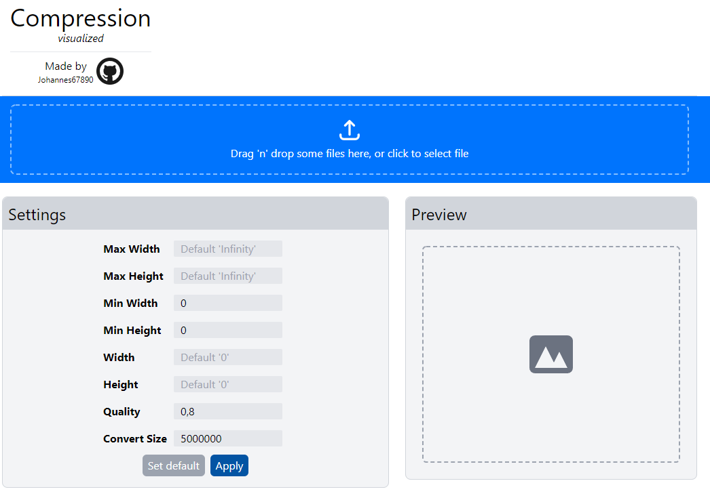

# Compressor Visualizer



```
Teachers feedback to next time

> Grade: A- (12 *Arrow down*)

- More focus on methods (Flowcharts, class diagram, explain Object focus programming and more)
- Have Powerpoint to bring more structure
- Focus more on code 
- Put Sources before extra content (Bilag)
```

###### Made by Johannes67890

#### School project (Yearly test - Open assignment)

## Frameworks & 3rd party libraries used

#### - React

#### - Tailwindcss

#### - [Compressorjs](https://github.com/fengyuanchen/compressorjs)

## How to build and run the program

_Programs need to install 3rd party libraries_

- Install [git-bash](https://git-scm.com/downloads)
- Install [Node.js](https://nodejs.org/en/download/)

#### Clone this repository with git-bash with this command:

```
git clone https://github.com/johannes67890/VirtualCompressor.git
```

#### Open the project in a text editor and install all the dependencies

(install via node package manager or yarn though the terminal)

```
npm install
```

#### Run one of the avaliable scripts to run the project

```
npm start
```

### Available Scripts (React default README on scripts)

In the project directory, you can run:

### `npm start`

Runs the app in the development mode.\
Open [http://localhost:3000](http://localhost:3000) to view it in the browser.

The page will reload if you make edits.\
You will also see any lint errors in the console.

### `npm build`

Builds the app for production to the `build` folder.\
It correctly bundles React in production mode and optimizes the build for the best performance.

The build is minified and the filenames include the hashes.\
Your app is ready to be deployed!

See the section about [deployment](https://facebook.github.io/create-react-app/docs/deployment) for more information.
